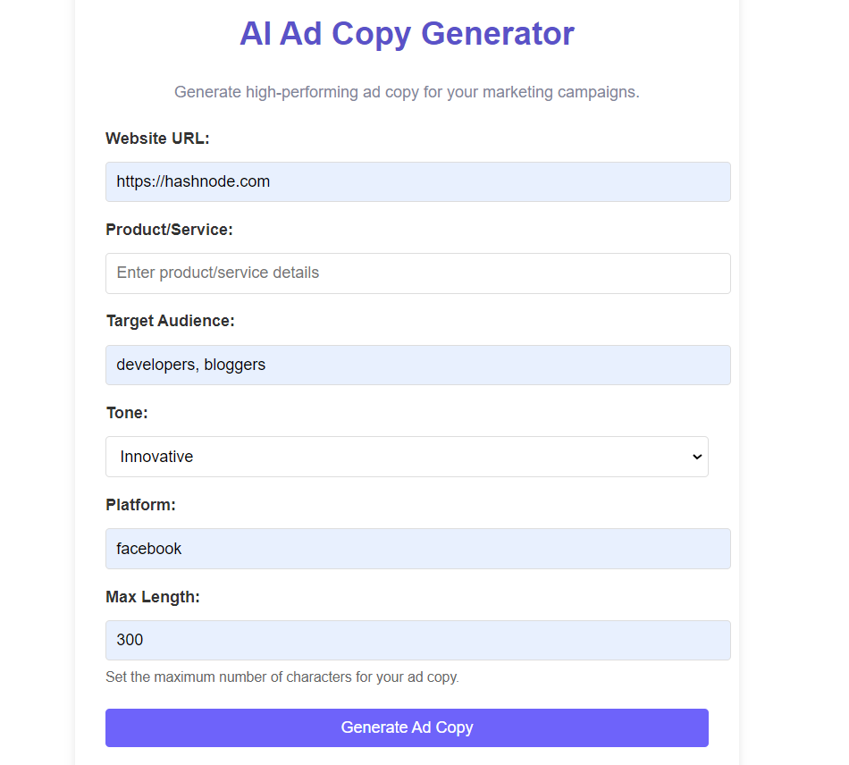

# AI Ad Copy Generator

## Introduction
The AI Ad Copy Generator Uses Cloudflare AI Worker and the Meta Llama 3.1-8B model to create high-quality, engaging ad copies tailored for marketing needs. This tool helps marketers and businesses generate compelling ad content quickly and efficiently.

## Tech Stack
- HTML
- CSS
- JavaScript
- Python/Flask
- Cloudflare AI Worker
- AI Model: Meta Llama 3.1-8B-Instruct

## Features
- **Effortless Input**: Simply provide product links or descriptions to get started.
- **Top-Notch Ad Copy**: Generate professional and persuasive ad copy in seconds.
- **Different Tones**: Tailor ad copy tone to fit your brand and style perfectly.
- **Customization/Regeneration**: You can easily Customize/Regenerate the generated adcopy according to your need.


## Installation
1. Clone the repository:
   ```
   git clone https://github.com/liferacer333/Ai_adcopy.git
   ```
2. Navigate to the project directory
   ```
   cd Ai_adcopy
   ```
3. Install dependencies:
   ```
   pip install -r requirements.txt
   ```
4. Create a .env file in the root directory of the project and add your environment variables:
   Grab your credentials from Cloudflare Account (https://cloudflare.com)
   ```
   API_BASE_URL="https://api.cloudflare.com/client/v4/accounts/{id}/ai/run/"
   ```
   ```
   API_KEY="{Your_Api_Key}"
   ```
## Usage
1. Run the application
   ```
   python app.py
   ```
2. Access the application via your browser at http://localhost:0000

## Contributing
Contributions are welcome! Please open an issue or submit a pull request.


## Screenshots

*Ad Copy Generator*


*Ad Copy Generation in Action*


*Generated Ad copy*
